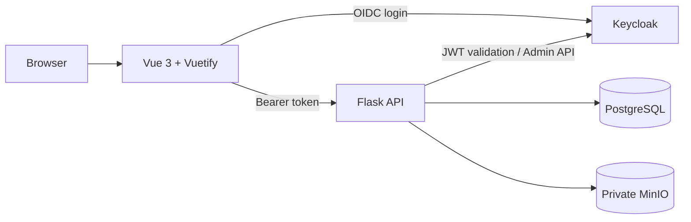

# SeniorMate

SeniorMate is a caregiver and patient management platform for home healthcare
agencies, adult day care centers, assisted living facilities, and independent
caregivers.

It centralizes patient records, caregiver and nursing visits, care notes,
assessments, private documents, patient photos, printable summaries,
organization branding, user administration, and operational reporting.

**Current version:** `1.0.0`

**Release status:** Stable initial public release prepared for tag `v1.0.0`

**Project website:** [salimsaidhemed.github.io/SeniorMate](https://salimsaidhemed.github.io/SeniorMate/)

## Features

- Patient demographics, status, photos, contacts, and diagnosis summaries
- Caregiver and nursing visit tracking
- Digital Aide Notes and Nurse Notes
- Patient assessments with optional visit linkage
- Private MinIO-backed medical records
- Dashboard metrics, operational reports, filters, and CSV export
- Browser-printable patient, visit, note, and assessment summaries
- Keycloak login, role-based access control, and admin user management
- Configurable organization branding with safe defaults
- Guarded fictional demo data for local evaluation
- Docker Compose local environment and GitHub Actions validation

## Technology Stack

- Backend: Python, Flask
- Frontend: Vue 3, Vuetify, Vite
- Database: PostgreSQL
- Authentication: Keycloak
- Object storage: MinIO
- Deployment: Docker, Docker Compose, Kubernetes-ready structure
- CI/CD: GitHub Actions

## Project Structure

```text
SeniorMate/
├── backend/                 # Flask API, models, migrations, and tests
│   ├── app/                 # Backend package
│   ├── requirements.txt     # Runtime Python dependencies
│   └── requirements-dev.txt # Development Python dependencies
├── frontend/                # Vue/Vuetify application
│   └── src/                 # Frontend source files
├── docs/                    # User, admin, technical, and architecture guides
├── keycloak/                # Local development realm import
├── .github/                 # GitHub templates, workflows, and ownership rules
├── docker-compose.yml       # Local service orchestration
├── .env.example             # Safe local environment template
├── CHANGELOG.md             # Project change history
└── CONTRIBUTING.md          # Contribution workflow
```

## Local Development

Docker Compose is the recommended way to run the local SeniorMate stack. It
starts Flask, Vue/Vite, PostgreSQL, MinIO, and Keycloak with safe local
placeholders from `.env.example`.

### Prerequisites

- Git
- Python 3.11 or newer
- Node.js 20 or newer
- Docker and Docker Compose

### Setup

1. Clone the repository.

   ```bash
   git clone git@github.com:salimsaidhemed/SeniorMate.git
   cd SeniorMate
   ```

2. Create your local environment file.

   ```bash
   cp .env.example .env
   ```

3. Prepare the backend environment.

   ```bash
   cd backend
   python -m venv .venv
   source .venv/bin/activate
   pip install -r requirements.txt -r requirements-dev.txt
   ```

4. Prepare the frontend environment.

   ```bash
   cd ../frontend
   npm install
   ```

5. Start the local stack.

   ```bash
   cd ..
   docker compose up --build
   ```

6. Open the local services.

   - Frontend: `http://localhost:5173`
   - Dashboard: `http://localhost:5173`
   - Patient management UI: `http://localhost:5173/patients`
   - Visits UI: `http://localhost:5173/visits`
   - Aide Notes UI: `http://localhost:5173/aide-notes`
   - Nurse Notes UI: `http://localhost:5173/nurse-notes`
   - Admin user management: `http://localhost:5173/admin/users`
   - Branding settings: `http://localhost:5173/settings/branding`
   - Backend health: `http://localhost:5001/api/health`
   - Swagger UI: `http://localhost:5001/api/docs`
   - OpenAPI JSON: `http://localhost:5001/api/openapi.json`
   - MinIO console: `http://localhost:9001`
   - PostgreSQL: `localhost:5432`

Authentication and Keycloak are enabled by default. Start the complete local
stack, including the imported development realm, with:

```bash
docker compose up --build
```

Keycloak runs at `http://localhost:8080`. SeniorMate uses Authorization Code
with PKCE in the frontend and validates signed access tokens, issuer, audience,
and expiry in the backend. See
[docs/setup/keycloak-local-setup.md](docs/setup/keycloak-local-setup.md) for
the imported realm, local demo users, roles, and Swagger testing workflow.

For a temporary unauthenticated development session, set both
`AUTH_ENABLED=false` and `VITE_AUTH_ENABLED=false`. Automated backend tests
continue to disable authentication explicitly.

Optional fictional demo records can be created through guarded Flask CLI
commands. Demo seeding is disabled by default and never runs at startup. See
[docs/setup/demo-data.md](docs/setup/demo-data.md) for enablement, seed, reset,
and safety instructions.

Administrators and managers can customize the app and organization names,
logo, theme colors, banner text, and footer text from `Settings → Branding`.
Custom logos remain private in MinIO and are delivered through the backend.

When authentication is enabled, administrators can manage Keycloak users,
temporary password resets, enabled status, and SeniorMate roles from
`Admin → Users`. See
[docs/user-guide/admin-user-management.md](docs/user-guide/admin-user-management.md)
for the workflow and safety constraints.

## CI Checks

GitHub Actions runs basic checks on pull requests and pushes to `main`:

- Backend CI installs Python dependencies, runs Ruff, and executes pytest.
- Frontend CI installs Node dependencies from the lockfile and runs the Vite build.
- Docker Build validates the Compose file and builds the backend and frontend images without pushing them.

## Printable Reports

Print-friendly reports are available from the detail pages for patients,
visits, aide notes, nurse notes, and patient assessments. Use the report's
`Print / Save PDF` action to open the browser print dialog, then select a
printer or choose the browser's PDF destination.

Printable patient summaries include recent visits, assessments, and medical
record metadata. Uploaded medical record files are referenced by name and are
not embedded in reports.

Operational analytics are available from the Reports section with patient
census, visit activity, staff activity, assessment, and medical-record views.
Each report supports relevant filters and CSV export. See
[docs/user-guide/reports.md](docs/user-guide/reports.md).

## Development Workflow

- Start new work from an up-to-date `main` branch.
- Create a focused feature or fix branch.
- Keep documentation and `CHANGELOG.md` updated with user-facing or workflow changes.
- Open a pull request using the repository template.
- Do not merge your own pull request. Only the maintainer merges into `main`.

See [CONTRIBUTING.md](CONTRIBUTING.md) for the full contribution process.

## Developer Learning Path

Maintainers and developers learning the codebase can start with the
[SeniorMate Developer Learning Guide](docs/learning/seniormate-developer-guide.md).
It connects the Flask backend, Vue frontend, PostgreSQL data model, Keycloak,
MinIO, Docker Compose, testing, CI/CD, troubleshooting, request diagrams, and
practical code exercises. The
[eight-week study plan](docs/learning/study-plan.md) provides a structured path
from local containers and Flask basics through authentication, CI/CD, and
production readiness.

## Architecture



The frontend never connects directly to PostgreSQL, MinIO, or Keycloak Admin
API. PostgreSQL stores domain data and file metadata; MinIO stores private
document, patient-photo, and branding-logo bytes.

See [Architecture Overview](docs/architecture/overview.md) and the
[diagram suite](docs/index.md#diagrams).

## Documentation

The [documentation index](docs/index.md) is the central starting point:

- [Public SeniorMate website](https://salimsaidhemed.github.io/SeniorMate/)
- [SeniorMate 1.0.0 Release Notes](docs/releases/v1.0.0.md)
- [User Guide](docs/index.md#user-guide)
- [Administrator Guide](docs/index.md#administrator-guide)
- [Technical Guide](docs/index.md#technical-guide)
- [Architecture](docs/index.md#architecture)
- [Diagrams and ERD](docs/index.md#diagrams)
- [Deployment Guide](docs/technical/deployment-guide.md)
- [API Overview](docs/technical/api-overview.md)

## Screenshots

Screenshots captured from fictional local demo data are stored under
[`docs/images/`](docs/images/README.md). Organization branding can change the
app name, logo, and theme colors shown in these examples.

| Dashboard | Patient management |
| --- | --- |
|  |  |
