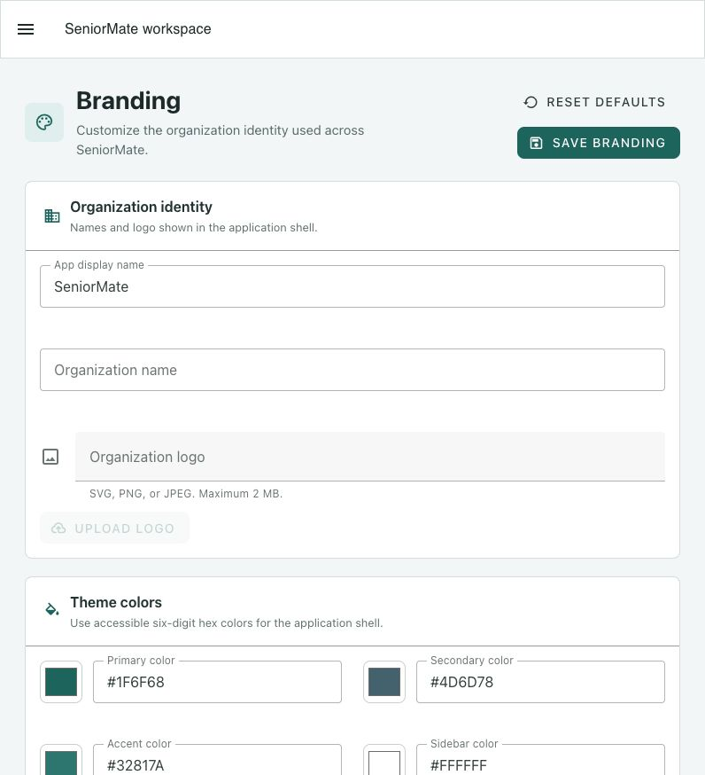

# Branding Configuration

Administrators and managers can customize SeniorMate from
**Settings > Branding**.

## Configurable Values

- Organization name
- App display name
- Logo
- Primary, secondary, accent, and sidebar colors
- Login banner text
- Footer text

Use the live preview before saving. Colors must use six-digit hexadecimal
format. Custom logos support SVG, PNG, and JPEG within the configured size
limit.

## Fallbacks

If a value is missing or invalid, SeniorMate falls back to its default app
name, Care Cross Wordmark, and theme. A missing private logo never results in a
broken image.

## Storage

Logo bytes are private in MinIO; PostgreSQL stores configuration and file
metadata. The public branding API returns only safe display values and a
backend preview URL.

See [Branding Design](../architecture/branding-design.md) for validation and
theme behavior.
