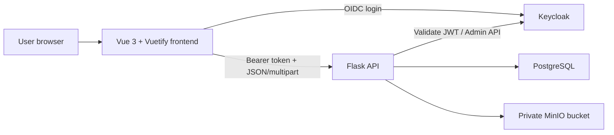

# Architecture Overview

SeniorMate is a browser-based modular monolith supported by external identity,
database, and object-storage services.

## Responsibilities

- **Vue** renders workflows, applies branding, manages OIDC session state, and
  hides actions unavailable to the current role.
- **Flask** validates identity, enforces permissions, validates domain input,
  serves Swagger, and coordinates database and object-storage operations.
- **PostgreSQL** stores domain data and file metadata.
- **MinIO** stores medical documents, patient photos, and organization logos.
- **Keycloak** stores users, credentials, sessions, roles, groups, and identity
  claims.

## Design Principles

- Backend authorization is authoritative.
- Private files are never stored as database binary columns.
- Domain APIs use consistent JSON envelopes.
- Large evolving clinical sections use JSON fields where rigid normalization
  would slow the early product.
- Local services run together through Docker Compose.

See the [High-Level Architecture diagram](../diagrams/high-level-architecture.md)
and the technical backend/frontend guides for implementation details.
