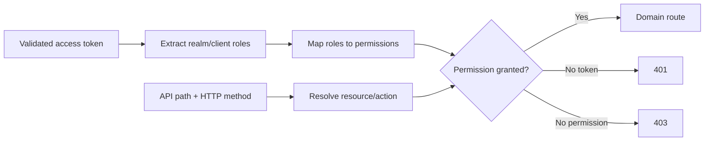

# RBAC Design

SeniorMate maps Keycloak roles to named application permissions.

## Roles

- admin
- manager
- nurse
- caregiver
- viewer

## Enforcement Flow

The backend centralizes mappings in `app/auth.py`. The frontend mirrors the
same permission names in `permission-policy.js` for navigation and action UX.

## Rules

- Backend checks remain authoritative.
- Admin wildcard access is deliberate and should remain narrowly assigned.
- Multiple roles combine their permission sets.
- Route guards and hidden buttons must not be treated as security controls.
- Future organization scoping must filter records after authentication and
  before domain data is returned.

See [Authentication Design](auth-design.md) and
[Roles and Permissions](../user-guide/roles-and-permissions.md).
