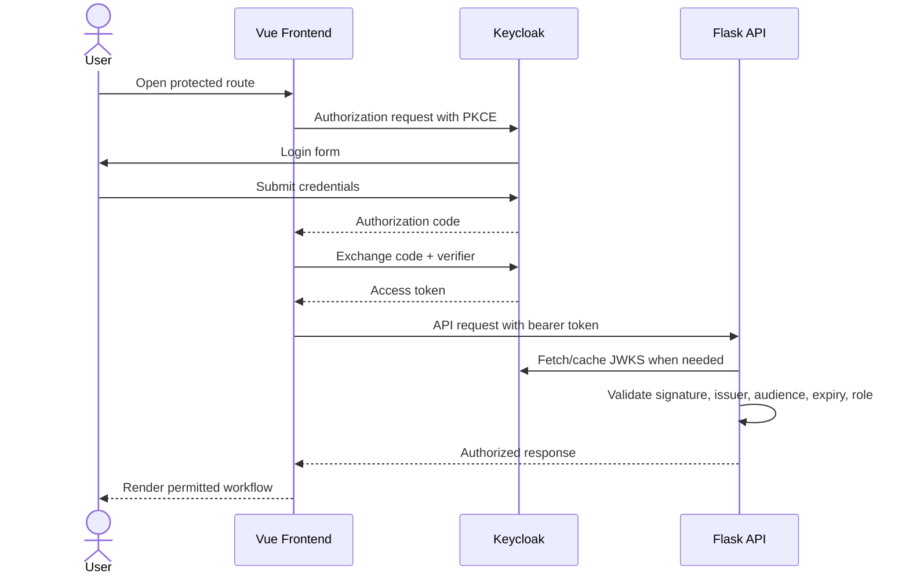

# Authentication Flow

```mermaid
sequenceDiagram
    actor User
    participant Vue as Vue Frontend
    participant KC as Keycloak
    participant API as Flask API

    User->>Vue: Open protected route
    Vue->>KC: Authorization request with PKCE
    KC->>User: Login form
    User->>KC: Submit credentials
    KC-->>Vue: Authorization code
    Vue->>KC: Exchange code + verifier
    KC-->>Vue: Access token
    Vue->>API: API request with bearer token
    API->>KC: Fetch/cache JWKS when needed
    API->>API: Validate signature, issuer, audience, expiry, role
    API-->>Vue: Authorized response
    Vue-->>User: Render permitted workflow
```

Keycloak owns credentials and sessions. SeniorMate owns application permission
enforcement.
