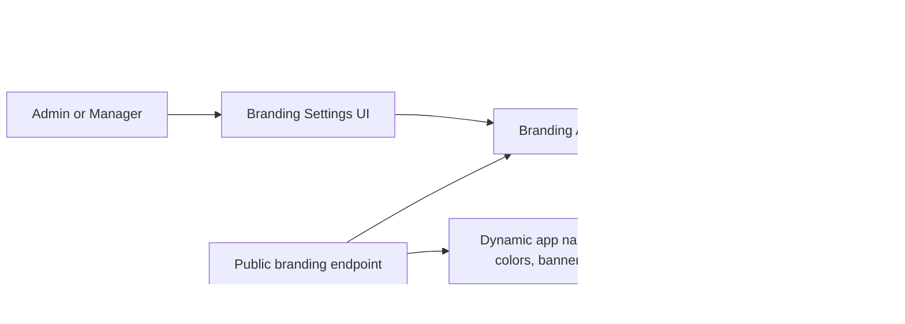

# Branding Flow

```mermaid
flowchart LR
    Admin["Admin or Manager"] --> Settings["Branding Settings UI"]
    Settings --> API["Branding API"]
    API --> DB[("OrganizationSettings in PostgreSQL")]
    API --> Store[("Private logo in MinIO")]
    Public["Public branding endpoint"] --> API
    Frontend["Vue startup"] --> Public
    DB --> API
    Store --> API
    Public --> Theme["Dynamic app name, logo, colors, banner, footer"]
    Theme --> Frontend
```

Missing values resolve independently to the bundled SeniorMate defaults.
