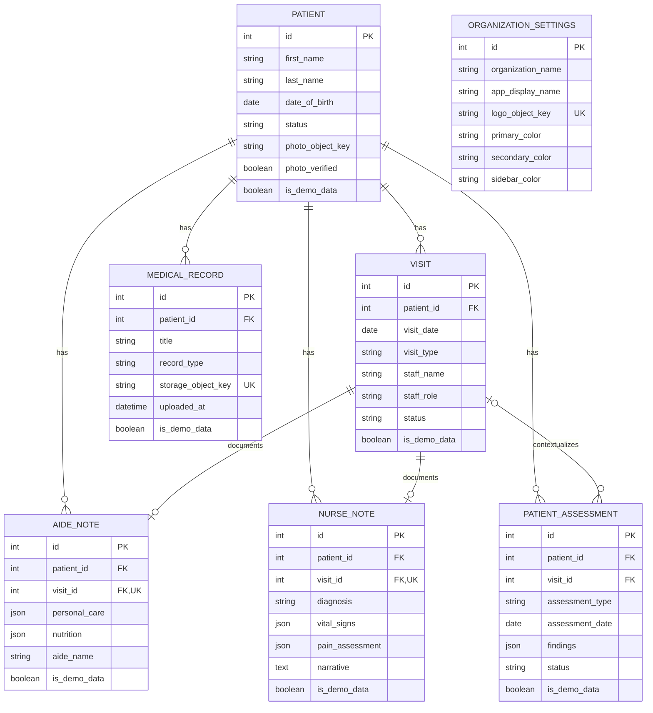

# Entity Relationship Diagram

```mermaid
erDiagram
    PATIENT {
        int id PK
        string first_name
        string last_name
        date date_of_birth
        string status
        string photo_object_key
        boolean photo_verified
        boolean is_demo_data
    }

    VISIT {
        int id PK
        int patient_id FK
        date visit_date
        string visit_type
        string staff_name
        string staff_role
        string status
        boolean is_demo_data
    }

    AIDE_NOTE {
        int id PK
        int patient_id FK
        int visit_id FK,UK
        json personal_care
        json nutrition
        string aide_name
        boolean is_demo_data
    }

    NURSE_NOTE {
        int id PK
        int patient_id FK
        int visit_id FK,UK
        string diagnosis
        json vital_signs
        json pain_assessment
        text narrative
        boolean is_demo_data
    }

    PATIENT_ASSESSMENT {
        int id PK
        int patient_id FK
        int visit_id FK
        string assessment_type
        date assessment_date
        json findings
        string status
        boolean is_demo_data
    }

    MEDICAL_RECORD {
        int id PK
        int patient_id FK
        string title
        string record_type
        string storage_object_key UK
        datetime uploaded_at
        boolean is_demo_data
    }

    ORGANIZATION_SETTINGS {
        int id PK
        string organization_name
        string app_display_name
        string logo_object_key UK
        string primary_color
        string secondary_color
        string sidebar_color
    }

    PATIENT ||--o{ VISIT : has
    PATIENT ||--o{ AIDE_NOTE : has
    PATIENT ||--o{ NURSE_NOTE : has
    PATIENT ||--o{ PATIENT_ASSESSMENT : has
    PATIENT ||--o{ MEDICAL_RECORD : has
    VISIT ||--o| AIDE_NOTE : documents
    VISIT ||--o| NURSE_NOTE : documents
    VISIT o|--o{ PATIENT_ASSESSMENT : contextualizes
```

`ORGANIZATION_SETTINGS` is a singleton in the current product and is not yet
connected to clinical records by an organization foreign key.
