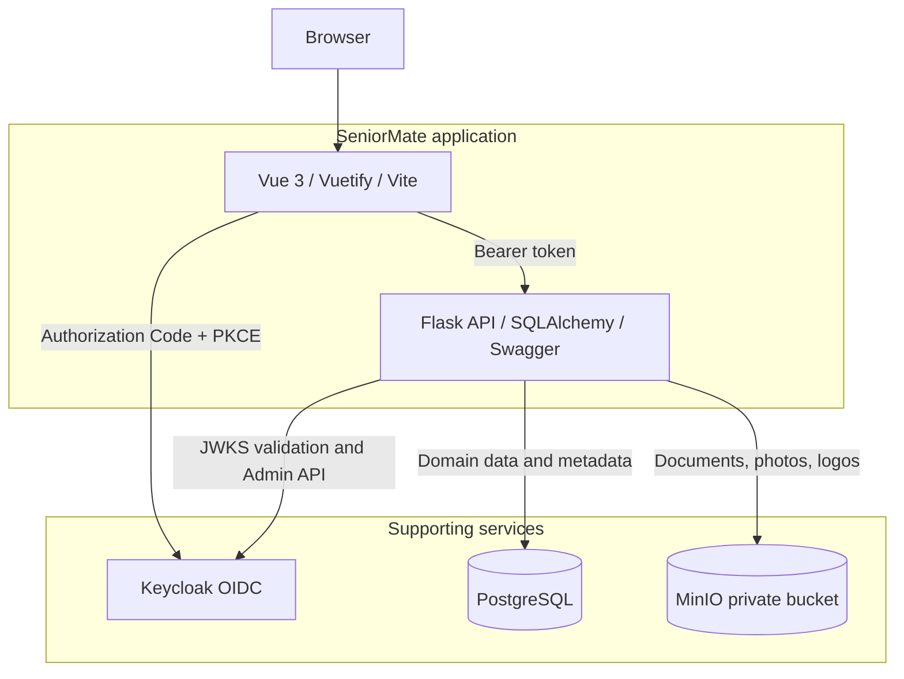

# High-Level Architecture

```mermaid
flowchart TB
    Browser["Browser"]

    subgraph App["SeniorMate application"]
        Frontend["Vue 3 / Vuetify / Vite"]
        Backend["Flask API / SQLAlchemy / Swagger"]
    end

    subgraph Services["Supporting services"]
        Keycloak["Keycloak OIDC"]
        Postgres[("PostgreSQL")]
        MinIO[("MinIO private bucket")]
    end

    Browser --> Frontend
    Frontend -->|Authorization Code + PKCE| Keycloak
    Frontend -->|Bearer token| Backend
    Backend -->|JWKS validation and Admin API| Keycloak
    Backend -->|Domain data and metadata| Postgres
    Backend -->|Documents, photos, logos| MinIO
```

The frontend never connects directly to PostgreSQL, MinIO, or Keycloak Admin
API.
