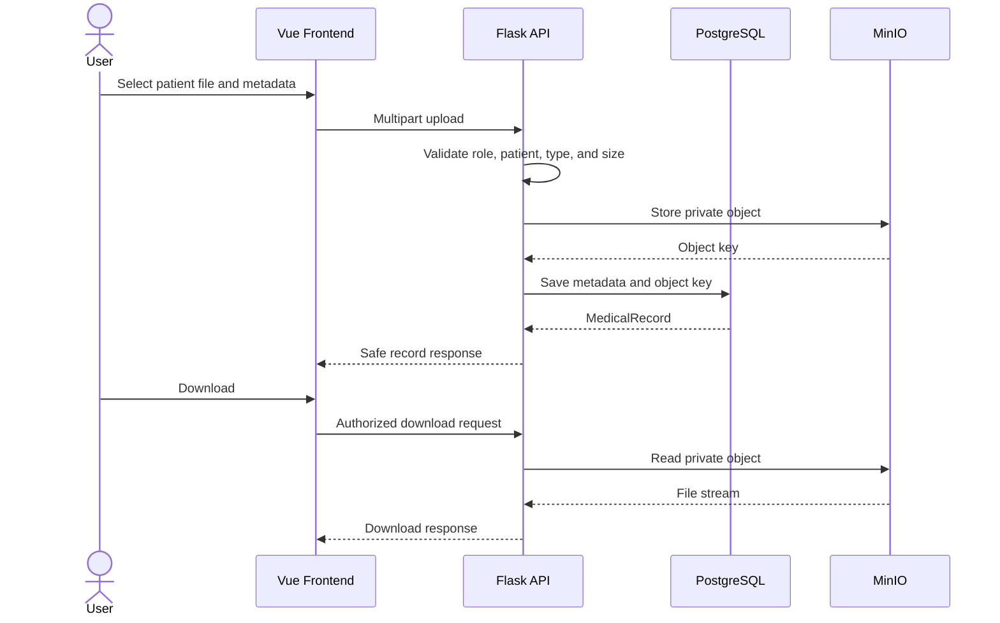

# Medical Records Workflow

```mermaid
sequenceDiagram
    actor User
    participant UI as Vue Frontend
    participant API as Flask API
    participant DB as PostgreSQL
    participant Store as MinIO

    User->>UI: Select patient file and metadata
    UI->>API: Multipart upload
    API->>API: Validate role, patient, type, and size
    API->>Store: Store private object
    Store-->>API: Object key
    API->>DB: Save metadata and object key
    DB-->>API: MedicalRecord
    API-->>UI: Safe record response

    User->>UI: Download
    UI->>API: Authorized download request
    API->>Store: Read private object
    Store-->>API: File stream
    API-->>UI: Download response
```

The private object key is an internal storage reference and should not be used
as a public URL.
