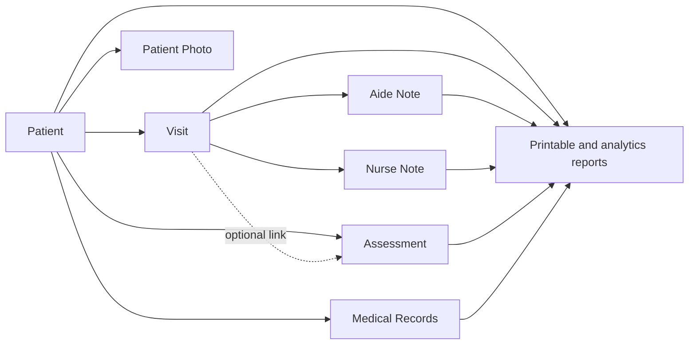

# Patient Workflow

```mermaid
flowchart LR
    Patient["Patient"] --> Visit["Visit"]
    Visit --> Aide["Aide Note"]
    Visit --> Nurse["Nurse Note"]
    Patient --> Assessment["Assessment"]
    Visit -. optional link .-> Assessment
    Patient --> Records["Medical Records"]
    Patient --> Photo["Patient Photo"]
    Patient --> Reports["Printable and analytics reports"]
    Visit --> Reports
    Aide --> Reports
    Nurse --> Reports
    Assessment --> Reports
    Records --> Reports
```

Aide and Nurse Notes are each limited to one per visit. Assessments may be
patient-only or linked to a visit.
