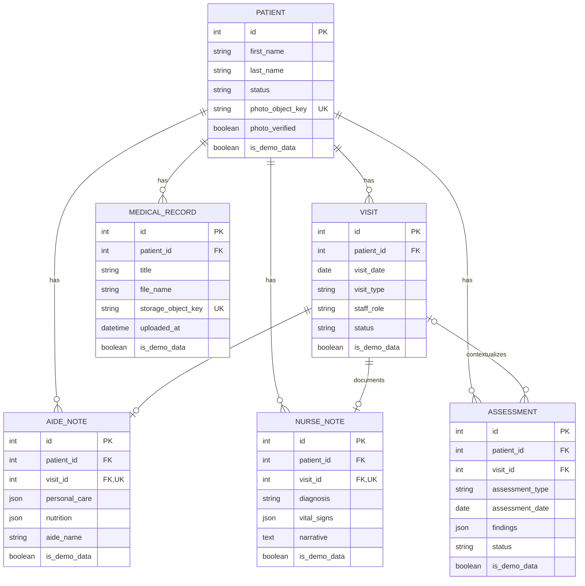

# Data Model Walkthrough

SeniorMate's relational model centers on a patient and the care activity around
that patient. Identity and file bytes remain in dedicated external systems.

## What Is PostgreSQL?

PostgreSQL is an open-source relational database. It stores structured data in
tables and supports relationships, transactions, constraints, indexes, JSON,
and a sophisticated query planner.

SeniorMate uses PostgreSQL because patient and care records have strong
relationships and integrity rules. A relational database can enforce required
fields, foreign keys, uniqueness, and status constraints while supporting
reporting queries across related records.

PostgreSQL is configured in `docker-compose.yml`, connected through
`DATABASE_URL`, modeled in `backend/app/models/`, and evolved through
`backend/migrations/`.

## PostgreSQL Concepts in SeniorMate

| Database topic | SeniorMate example |
| --- | --- |
| Table | `patients`, `visits`, `medical_records` |
| Row | One patient or visit instance |
| Primary key | Integer `id` |
| Foreign key | `visits.patient_id -> patients.id` |
| Relationship | Patient has many Visits |
| Index | Patient/visit foreign keys and demo markers |
| Unique constraint | One AideNote/NurseNote per visit |
| Check constraint | Visit status and staff role |
| Transaction | Upload metadata commit or patient creation |
| JSON column | Nurse Note clinical sections |

### Tables and Relationships

SQLAlchemy model classes map to PostgreSQL tables. Foreign keys express
ownership; ORM relationships make related Python objects navigable.

### Indexes

Indexes speed lookups and joins but consume space and make writes slightly more
expensive. SeniorMate indexes foreign keys and frequently selected demo
markers. Future filtering should be measured before adding broad indexes.

### Constraints

Constraints protect data even if a future client bypasses current route
validation. Check, foreign-key, unique, and not-null constraints complement
application validation.

### Transactions

`db.session.commit()` makes a unit of database work durable. A rollback keeps
partial changes from persisting. Cross-system MinIO/database operations are
not one distributed transaction, so routes use compensating deletion.

### Query Planning

PostgreSQL chooses scans, joins, and indexes using table statistics. Use
`EXPLAIN` or `EXPLAIN ANALYZE` on slow queries, especially reporting and
multi-filter list endpoints. Never run `EXPLAIN ANALYZE` on a destructive
statement against real data without understanding its execution.

## Entity Relationship Diagram

The repository also has a fuller [existing ERD](../diagrams/erd.md).

## Patient

`Patient` is the central domain entity.

It stores:

- Identity and demographics.
- Contact and emergency contact details.
- Diagnosis summary and active/inactive status.
- Patient photo metadata.
- Demo-data marker.
- Created and updated timestamps.

Relationships cascade to visits, notes, assessments, and medical records. A
patient delete is therefore a high-impact operation.

Photo bytes are not stored in the row. `photo_object_key` points to private
MinIO storage.

## Visit

A Visit belongs to exactly one Patient.

It records:

- Date and visit type.
- Staff name and aide/nurse role.
- Time in and out.
- Notes and scheduled/completed/cancelled status.

A visit may have:

- Zero or one AideNote.
- Zero or one NurseNote.
- Many Assessments.

Deleting a visit cascades its Aide/Nurse Note. Assessment foreign keys use
`SET NULL`, preserving assessments without visit context.

## AideNote

An AideNote belongs to one Patient and one Visit. `visit_id` is unique, so a
visit cannot have duplicate aide notes.

Checklist sections are JSON:

- Personal care
- Nutrition
- Mental status
- Elimination
- Activity
- Assistive devices
- Housekeeping

JSON provides flexibility while the clinical form evolves, but it reduces
database-level validation and reporting convenience. Changes to the JSON shape
must remain backward compatible or include a migration strategy.

## NurseNote

A NurseNote has the same one-per-visit rule and contains larger clinical JSON
sections such as vital signs, pain, respiratory, cardiac, skin, and functional
status.

Long narrative fields remain text columns. This hybrid approach keeps common
free text simple while allowing structured sections to evolve.

## PatientAssessment

An assessment always belongs to a Patient and may belong to a Visit.

Supported types are constrained:

- `fall_risk`
- `nutrition`
- `mobility`
- `cognitive`
- `general`

Status is `draft` or `completed`. Findings are JSON; summary and
recommendations are text.

## MedicalRecord

MedicalRecord stores metadata:

- Patient link.
- Title, description, and type.
- Original filename, MIME type, and size.
- MinIO bucket and object key.
- Uploader and timestamps.

It does not store file bytes. Upload and delete workflows must keep PostgreSQL
metadata and MinIO object lifecycle aligned.

## OrganizationSettings

OrganizationSettings is currently a singleton row, not a multi-tenant
relationship.

It stores:

- Organization and app display names.
- Custom logo metadata/object key.
- Theme colors.
- Login banner and footer text.

The public branding endpoint resolves safe defaults when no row or custom
value exists.

## Users and Roles

There is no SeniorMate `User` table.

Keycloak stores:

- User identity.
- Passwords and sessions.
- Enabled and verified state.
- Realm roles.

JWT claims connect a logged-in identity to SeniorMate permissions at request
time. The current roles are admin, manager, nurse, caregiver, and viewer.

This means clinical records currently reference staff names as strings rather
than Keycloak user IDs. A future audit model may store immutable identity
subject IDs alongside display names.

## Demo Data Marker

Major domain records include `is_demo_data`, defaulting to false. Seed and
clear commands use this marker so demo cleanup does not delete normal records.

## Migration History

Migration files document model evolution:

1. Patients
2. Visits
3. Aide Notes
4. Nurse Notes
5. Medical Records
6. Patient photo fields
7. Assessments
8. Organization settings
9. Demo-data markers

Reading migrations in order is often the clearest way to understand why the
current schema looks the way it does.

## Understanding the Design

### Why PostgreSQL instead of MongoDB?

SeniorMate's patient, visit, note, assessment, and record relationships benefit
from foreign keys, transactions, constraints, and joins. PostgreSQL also
supports JSON for flexible clinical sections, so the project can combine
relational integrity with selected document-like fields.

MongoDB could make evolving large JSON documents easier, but relationship
integrity and cross-record reporting would move more responsibility into
application code. PostgreSQL's tradeoff is that schema changes require
migrations and careful relational design.

## Learning Resources

### Beginner

- [PostgreSQL Tutorial](https://www.postgresql.org/docs/current/tutorial.html)
- [PostgreSQLTutorial.com](https://www.postgresqltutorial.com/)

### Intermediate

- [Indexes](https://www.postgresql.org/docs/current/indexes.html)
- [Concurrency Control and Transactions](https://www.postgresql.org/docs/current/mvcc.html)
- [Using EXPLAIN](https://www.postgresql.org/docs/current/using-explain.html)
- [SQLAlchemy ORM Quick Start](https://docs.sqlalchemy.org/en/20/orm/quickstart.html)

### Official Documentation

- [PostgreSQL Documentation](https://www.postgresql.org/docs/)
- [PostgreSQL SQL Commands](https://www.postgresql.org/docs/current/sql-commands.html)
- [SQLAlchemy Documentation](https://docs.sqlalchemy.org/en/20/)

## Suggested Database Experiments

1. Use `psql` to describe the `patients` and `visits` tables.
2. Insert related test records through the API, then inspect their foreign
   keys.
3. Run `EXPLAIN` on the patient search query with and without filters.
4. Trigger a check-constraint failure in a disposable database.
5. Open a transaction, update a test row, roll it back, and confirm no change.
6. Add an index in a throwaway migration and compare the query plan.
