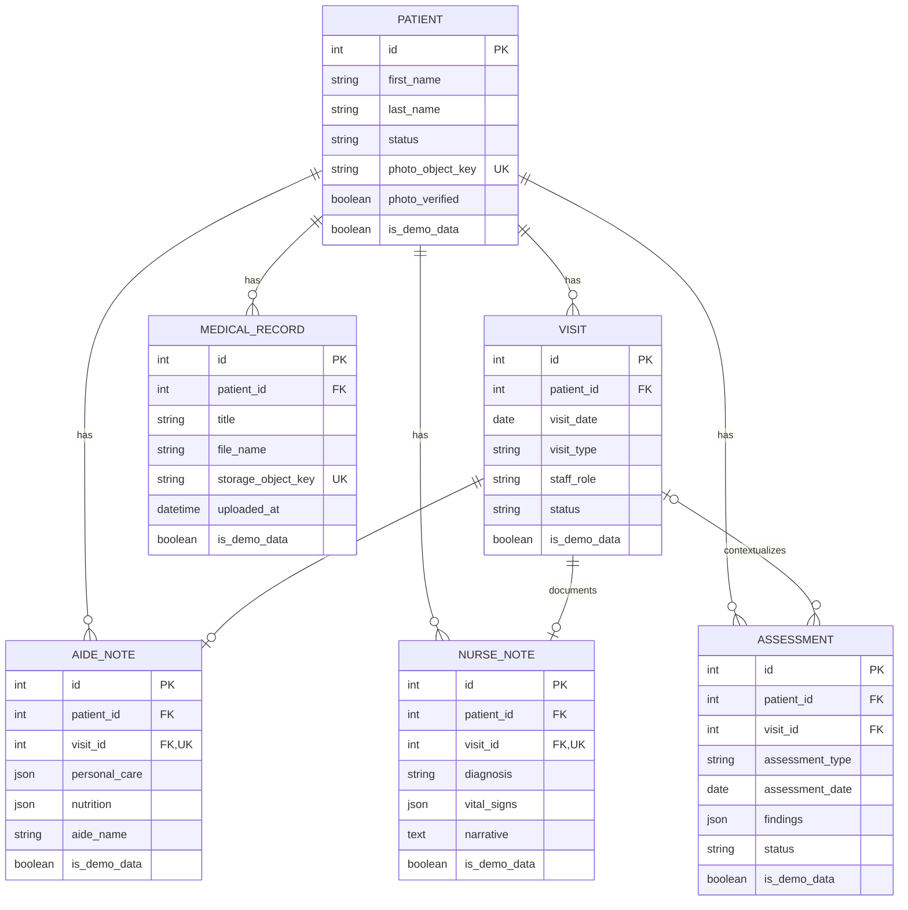

# Data Model Walkthrough

SeniorMate's relational model centers on a patient and the care activity around
that patient. Identity and file bytes remain in dedicated external systems.

## Entity Relationship Diagram

The repository also has a fuller [existing ERD](../diagrams/erd.md).

## Patient

`Patient` is the central domain entity.

It stores:

- Identity and demographics.
- Contact and emergency contact details.
- Diagnosis summary and active/inactive status.
- Patient photo metadata.
- Demo-data marker.
- Created and updated timestamps.

Relationships cascade to visits, notes, assessments, and medical records. A
patient delete is therefore a high-impact operation.

Photo bytes are not stored in the row. `photo_object_key` points to private
MinIO storage.

## Visit

A Visit belongs to exactly one Patient.

It records:

- Date and visit type.
- Staff name and aide/nurse role.
- Time in and out.
- Notes and scheduled/completed/cancelled status.

A visit may have:

- Zero or one AideNote.
- Zero or one NurseNote.
- Many Assessments.

Deleting a visit cascades its Aide/Nurse Note. Assessment foreign keys use
`SET NULL`, preserving assessments without visit context.

## AideNote

An AideNote belongs to one Patient and one Visit. `visit_id` is unique, so a
visit cannot have duplicate aide notes.

Checklist sections are JSON:

- Personal care
- Nutrition
- Mental status
- Elimination
- Activity
- Assistive devices
- Housekeeping

JSON provides flexibility while the clinical form evolves, but it reduces
database-level validation and reporting convenience. Changes to the JSON shape
must remain backward compatible or include a migration strategy.

## NurseNote

A NurseNote has the same one-per-visit rule and contains larger clinical JSON
sections such as vital signs, pain, respiratory, cardiac, skin, and functional
status.

Long narrative fields remain text columns. This hybrid approach keeps common
free text simple while allowing structured sections to evolve.

## PatientAssessment

An assessment always belongs to a Patient and may belong to a Visit.

Supported types are constrained:

- `fall_risk`
- `nutrition`
- `mobility`
- `cognitive`
- `general`

Status is `draft` or `completed`. Findings are JSON; summary and
recommendations are text.

## MedicalRecord

MedicalRecord stores metadata:

- Patient link.
- Title, description, and type.
- Original filename, MIME type, and size.
- MinIO bucket and object key.
- Uploader and timestamps.

It does not store file bytes. Upload and delete workflows must keep PostgreSQL
metadata and MinIO object lifecycle aligned.

## OrganizationSettings

OrganizationSettings is currently a singleton row, not a multi-tenant
relationship.

It stores:

- Organization and app display names.
- Custom logo metadata/object key.
- Theme colors.
- Login banner and footer text.

The public branding endpoint resolves safe defaults when no row or custom
value exists.

## Users and Roles

There is no SeniorMate `User` table.

Keycloak stores:

- User identity.
- Passwords and sessions.
- Enabled and verified state.
- Realm roles.

JWT claims connect a logged-in identity to SeniorMate permissions at request
time. The current roles are admin, manager, nurse, caregiver, and viewer.

This means clinical records currently reference staff names as strings rather
than Keycloak user IDs. A future audit model may store immutable identity
subject IDs alongside display names.

## Demo Data Marker

Major domain records include `is_demo_data`, defaulting to false. Seed and
clear commands use this marker so demo cleanup does not delete normal records.

## Migration History

Migration files document model evolution:

1. Patients
2. Visits
3. Aide Notes
4. Nurse Notes
5. Medical Records
6. Patient photo fields
7. Assessments
8. Organization settings
9. Demo-data markers

Reading migrations in order is often the clearest way to understand why the
current schema looks the way it does.
