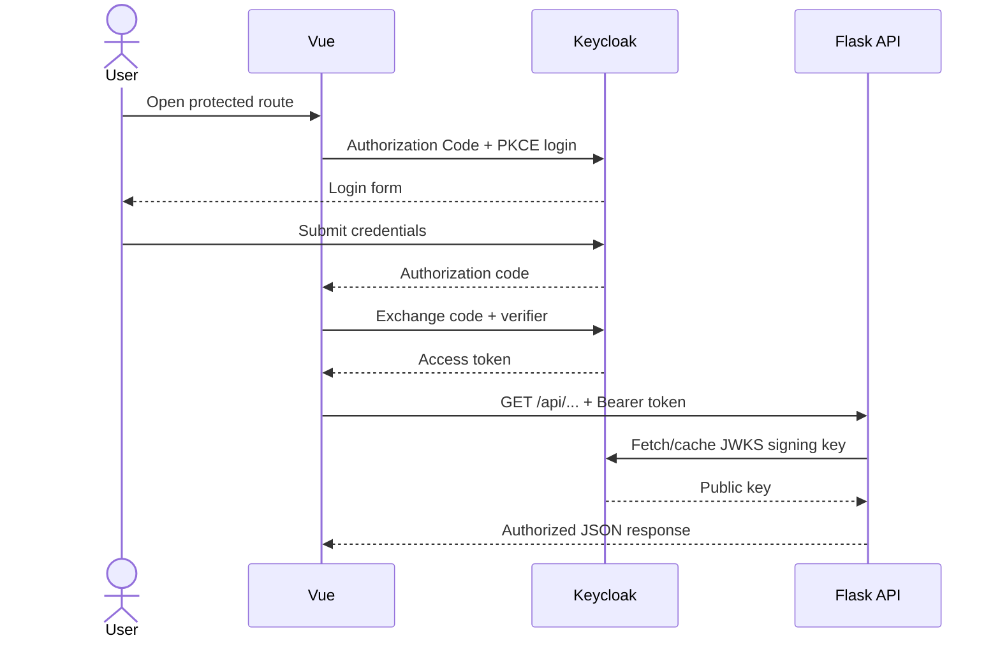
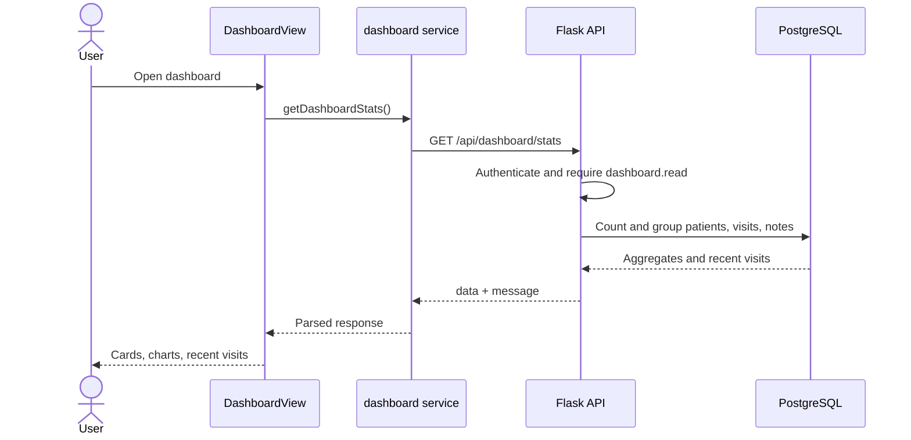
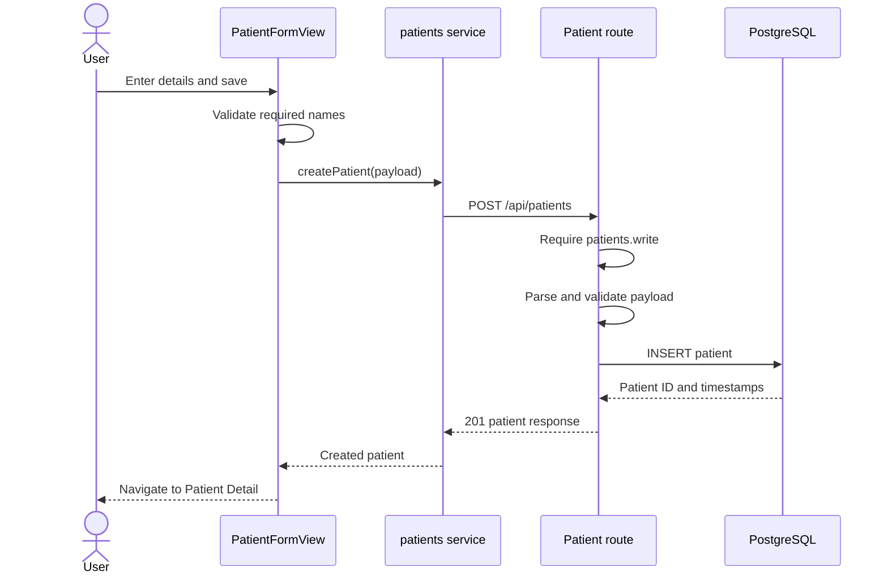
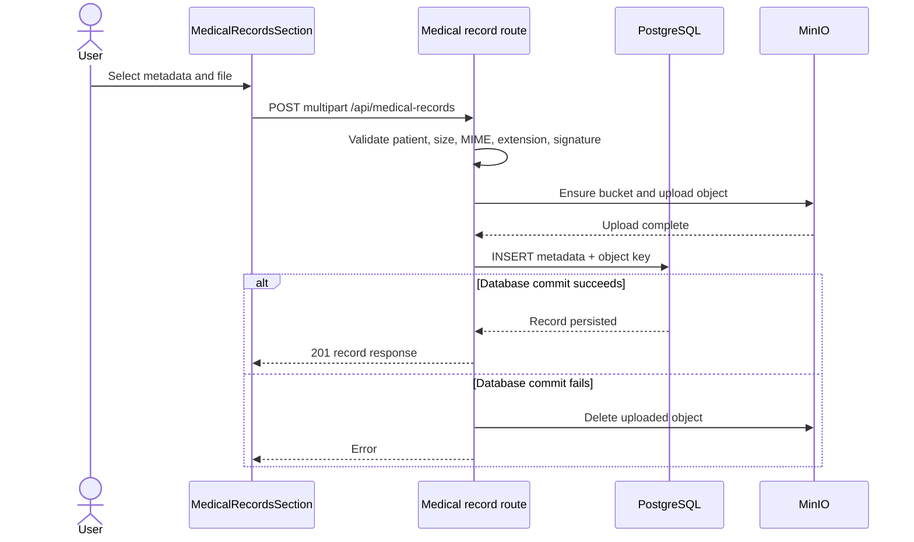
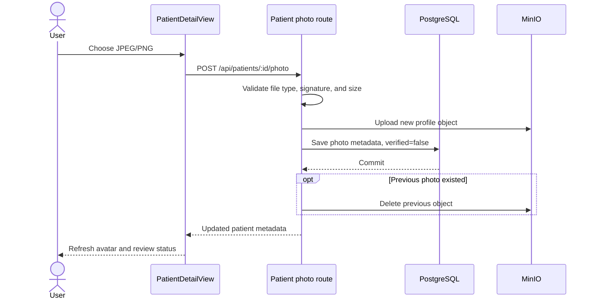
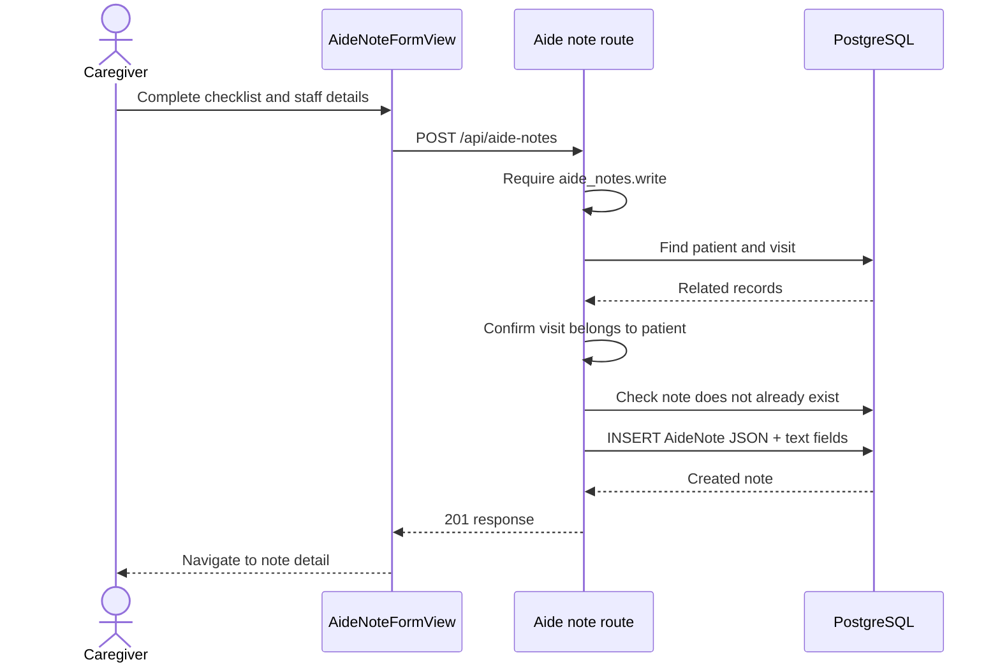
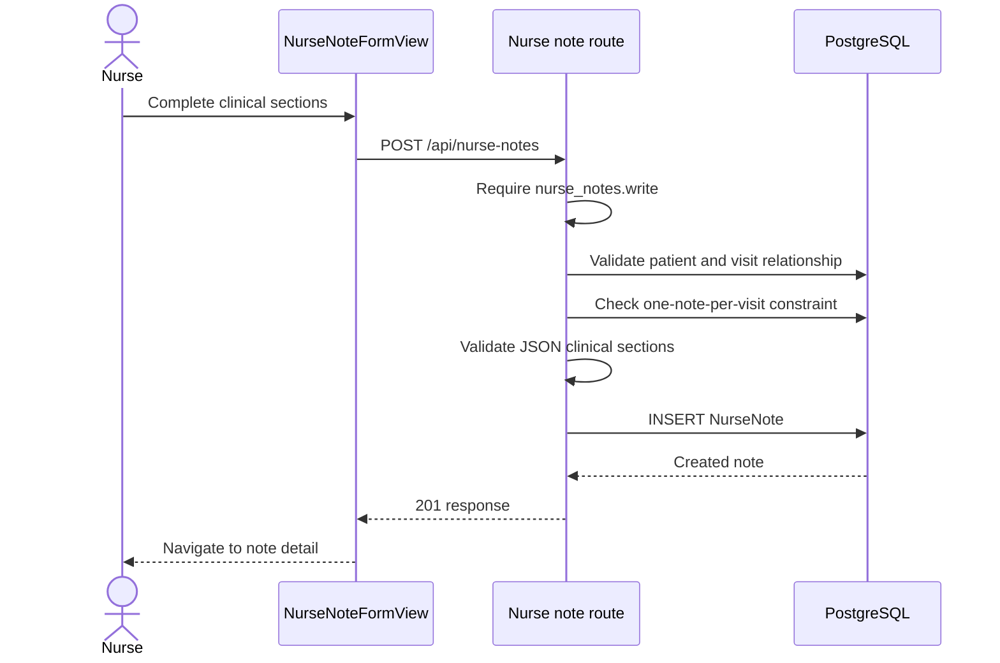
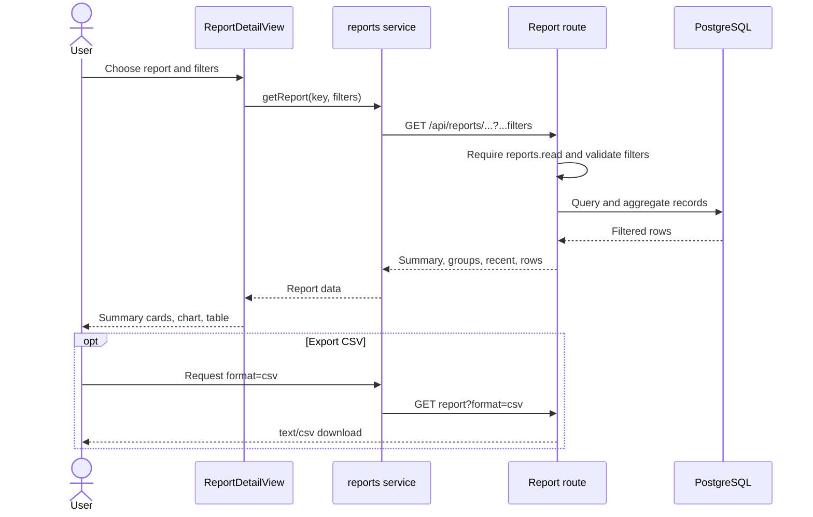

# SeniorMate Request Flows

These sequence diagrams show the major runtime boundaries. The exact UI
component varies, but the authentication, API, persistence, and storage paths
remain consistent.

## User Login

## Loading the Dashboard

## Creating a Patient

## Uploading a Medical Record

## Uploading a Patient Photo

## Creating an Aide Note

## Creating a Nurse Note

## Generating a Report

