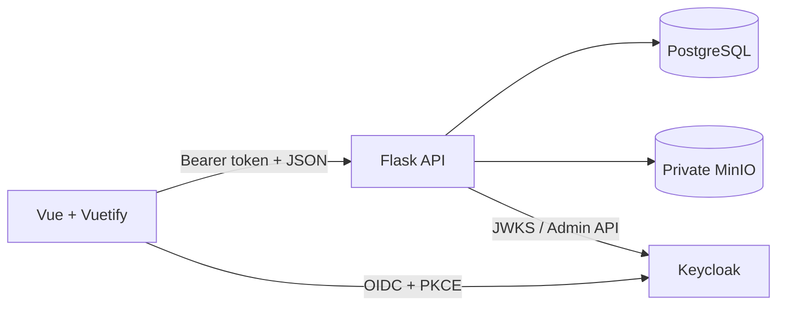

# SeniorMate Developer Learning Guide

This guide is the starting point for understanding SeniorMate v1.0.0 as a
developer and maintainer. It explains how the pieces connect, which files are
important, and how to reason about a change before editing code.

## Project Purpose

SeniorMate is a caregiver and patient management platform. The application
connects patient demographics, visits, clinical notes, assessments, private
medical records, photos, reports, authentication, user administration, and
organization branding.

The codebase is a useful platform engineering learning project because it
combines:

- A Vue 3 and Vuetify browser application.
- A Flask JSON API.
- PostgreSQL for relational domain data.
- MinIO for private object storage.
- Keycloak for identity and roles.
- Docker Compose for local orchestration.
- GitHub Actions for validation and GitHub Pages deployment.

## Repository Map

```text
SeniorMate/
├── backend/
│   ├── app/
│   │   ├── models/          # SQLAlchemy domain entities
│   │   ├── routes/          # Flask blueprints, validation, and API behavior
│   │   ├── __init__.py      # Flask application factory
│   │   ├── auth.py          # JWT authentication and API authorization
│   │   ├── config.py        # Environment-backed configuration
│   │   ├── storage.py       # Private MinIO adapter
│   │   ├── keycloak_admin.py# Keycloak Admin API client
│   │   └── swagger.py       # Flasgger/OpenAPI specifications
│   ├── migrations/          # Alembic migrations managed by Flask-Migrate
│   └── tests/               # Pytest API and service-boundary tests
├── frontend/
│   ├── src/
│   │   ├── components/      # Reusable Vuetify components
│   │   ├── services/        # HTTP and domain API clients
│   │   ├── views/           # Routed application screens
│   │   ├── auth.js          # Keycloak client and reactive auth state
│   │   ├── router.js        # Routes and permission guard
│   │   ├── permissions.js   # UI permission helpers
│   │   └── main.js          # Frontend bootstrap and Vuetify configuration
│   └── tests/               # Focused frontend permission tests
├── keycloak/                # Development realm import
├── docs/                    # Product, operations, and architecture docs
├── docs-site/               # VitePress public website
├── .github/workflows/       # CI and GitHub Pages workflows
├── docker-compose.yml       # Local service graph
└── .env.example             # Safe environment variable reference
```

## System at a Glance



The browser never connects directly to PostgreSQL, MinIO, or the Keycloak
Admin API. Flask is the application boundary for domain behavior and private
storage.

## Backend Architecture

Start at [`backend/app/__init__.py`](../../backend/app/__init__.py).
`create_app()`:

1. Creates the Flask application.
2. Loads environment-backed configuration.
3. Enables CORS for `/api/*`.
4. initializes Flasgger, SQLAlchemy, and Flask-Migrate.
5. Installs the global authentication/authorization hook.
6. Registers every domain blueprint.
7. Registers demo-data CLI commands.
8. Defines the public health and root endpoints.

Most domain behavior is currently route-centric. A route module generally
contains:

- Request parsing and validation helpers.
- SQLAlchemy queries.
- Transaction commits.
- Consistent JSON response helpers.
- Flasgger specification references.

Focused external-service logic is extracted:

- `storage.py` wraps MinIO.
- `keycloak_admin.py` wraps Keycloak Admin API calls.
- `auth.py` validates JWTs and maps roles to permissions.

Read [Flask Backend Guide](flask-backend-guide.md) for a complete walkthrough.

## Frontend Architecture

Start at [`frontend/src/main.js`](../../frontend/src/main.js). Bootstrap order
matters:

1. Public branding is loaded.
2. Keycloak authentication is initialized.
3. The router is imported.
4. Vuetify is created with resolved branding colors.
5. Reusable components are registered.
6. The app mounts.

Routes in `router.js` carry permission metadata. The global route guard requires
authentication and redirects unauthorized navigation to `/access-denied`.
Views call domain functions under `src/services/`, update Vue refs/reactive
state, and render Vuetify components.

Read [Vue Frontend Guide](vue-frontend-guide.md) for the detailed flow.

## Database Architecture

PostgreSQL stores domain records and metadata:

- Patient is the central aggregate.
- Visits belong to patients.
- Aide Notes and Nurse Notes each belong to one patient and one visit.
- A visit can have at most one note of each type.
- Assessments belong to a patient and may reference a visit.
- Medical Records belong to a patient and store file metadata.
- OrganizationSettings is a singleton branding record.

File bytes and user identities are deliberately outside PostgreSQL:

- MinIO stores files, patient photos, and branding logos.
- Keycloak stores users, credentials, sessions, and role assignments.

Read [Data Model Walkthrough](data-model-walkthrough.md).

## Authentication Flow

The frontend uses `keycloak-js` with Authorization Code flow and PKCE. The API
expects a bearer access token when `AUTH_ENABLED=true`.

The Flask `before_request` hook:

1. Allows public endpoints and CORS preflight requests.
2. Reads the bearer token.
3. Fetches the matching signing key from Keycloak JWKS.
4. Validates RS256 signature, issuer, audience, and expiry.
5. Extracts approved realm and API client roles.
6. Maps the request path and HTTP method to a permission.
7. Returns `401` or `403`, or allows the route to run.

When authentication is explicitly disabled, backend and frontend both use an
admin-like development identity. This is for local testing, not production.

## File Storage Flow

Medical records, patient photos, and branding logos use the same private
storage adapter.

1. A multipart request reaches Flask.
2. The route validates the record owner, filename, MIME type, file signature,
   and configured size limit.
3. Flask creates an object key.
4. `MinioPrivateObjectStorage` ensures the private bucket exists and uploads
   the stream.
5. PostgreSQL stores metadata and the object key.
6. Downloads are streamed through Flask.

If database persistence fails after upload, the route attempts to remove the
new object. This prevents common orphan-file cases.

## API Design

API routes live below `/api`. Common JSON responses are:

```json
{
  "data": {},
  "message": "Patient created successfully"
}
```

Paginated endpoints add:

```json
{
  "pagination": {
    "page": 1,
    "per_page": 10,
    "total": 26,
    "pages": 3
  }
}
```

Validation errors use a message plus field errors:

```json
{
  "message": "Invalid patient data",
  "errors": {
    "first_name": "This field is required."
  }
}
```

Flasgger builds Swagger UI at `/api/docs` and OpenAPI JSON at
`/api/openapi.json`. The schemas are Python dictionaries in `app/swagger.py`;
they are documentation, not the runtime validator.

## Testing Strategy

Backend tests use Pytest, an in-memory SQLite database, Flask's test client,
and fake MinIO and Keycloak Admin clients. Authentication tests monkeypatch JWT
decoding, so unit tests do not require a live identity provider.

Frontend automated coverage currently focuses on the pure permission policy.
The Vite production build catches template, import, and bundling failures.
Interactive workflows still rely on local browser verification.

Useful commands:

```bash
cd backend
.venv/bin/ruff check app tests
.venv/bin/pytest -q

cd ../frontend
npm run test:permissions
npm run build
```

## CI/CD Flow

Pull requests and pushes to `main` run:

- Backend Ruff and Pytest.
- Frontend Vite build.
- Docker Compose validation and backend/frontend image builds.

The GitHub Pages workflow builds `docs-site/` and deploys the artifact after
changes reach `main`. No workflow currently publishes application containers
or deploys the application to a production environment.

## Docker Compose Setup

`docker-compose.yml` starts five services:

| Service | Container address | Host address |
| --- | --- | --- |
| Frontend | `frontend:5173` | `localhost:5173` |
| Backend | `backend:5000` | `localhost:5001` |
| PostgreSQL | `postgres:5432` | `localhost:5432` |
| MinIO | `minio:9000` | `localhost:9000` |
| Keycloak | `keycloak:8080` | `localhost:8080` |

Inside a container, `localhost` means that same container. Use Compose service
names for container-to-container communication. This distinction explains
many database, MinIO, and Keycloak connection failures.

## First Troubleshooting Loop

When something fails:

1. Identify the boundary: browser, frontend, API, database, storage, or identity.
2. Inspect service status with `docker compose ps`.
3. Read the relevant logs with `docker compose logs --tail=200 <service>`.
4. Confirm effective configuration with `docker compose config`.
5. Test the backend health endpoint.
6. Reproduce the failing API call in Swagger or with `curl`.
7. Run the closest unit test.
8. Change one layer at a time.

Use the detailed [Troubleshooting Guide](troubleshooting.md) for symptom-based
diagnosis.

## Recommended Learning Path

1. Follow the [Code Reading Roadmap](code-reading-roadmap.md).
2. Read the backend and frontend guides side by side.
3. Trace one workflow in [Request Flows](request-flows.md).
4. Run the app and compare logs with the sequence diagram.
5. Complete a small task in [Learning Exercises](exercises.md).
6. Write down which boundary surprised you. That is usually the best next
   topic to study.
