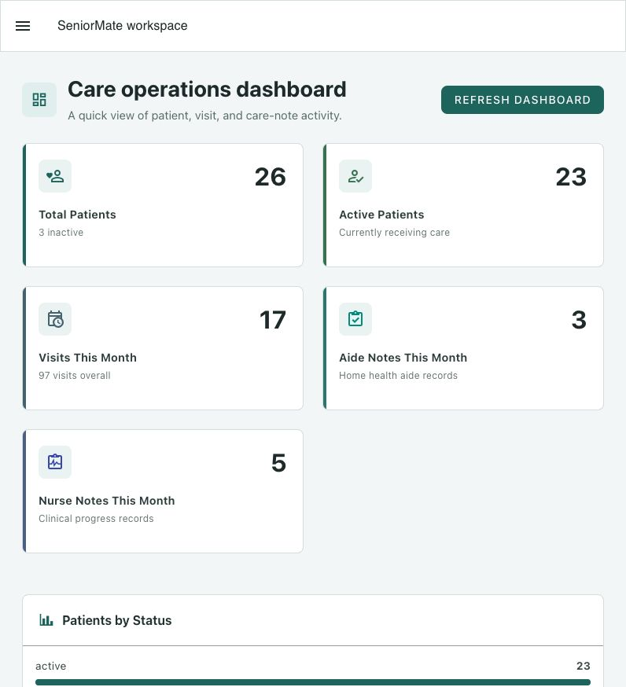
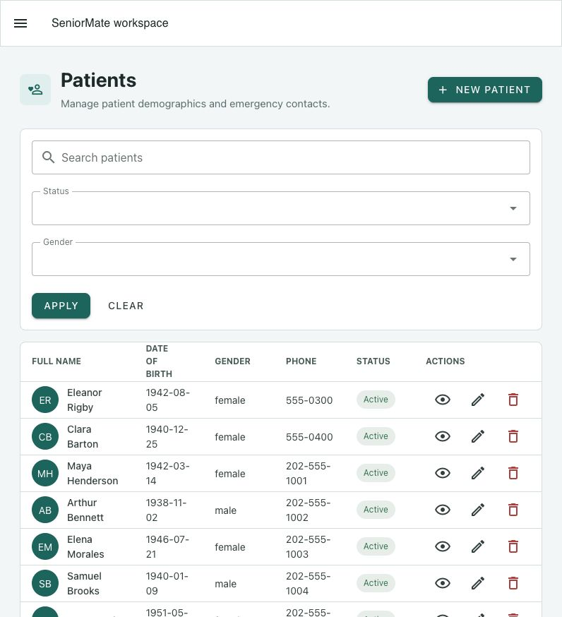
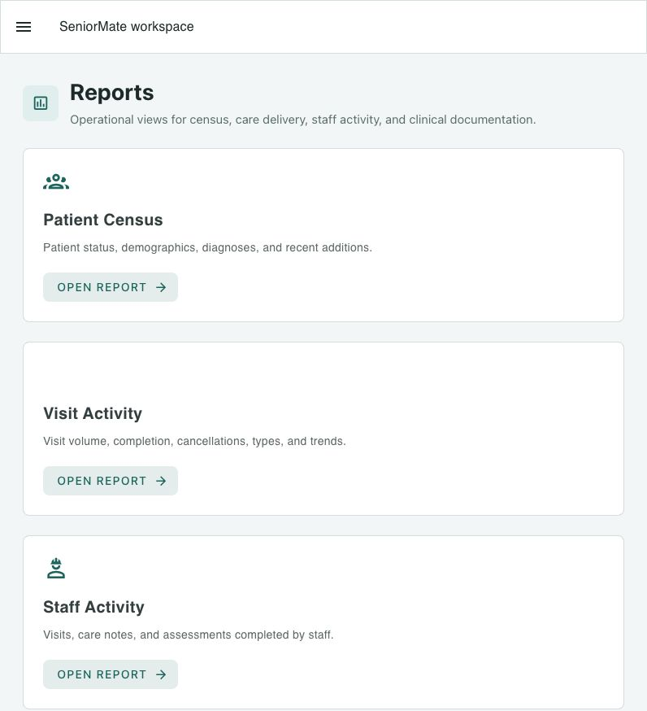
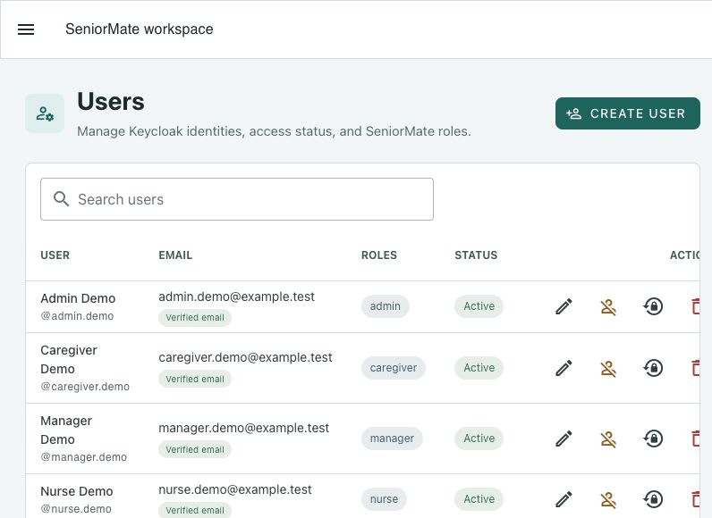

# SeniorMate 1.0.0 - Initial Public Release

## Release Overview

SeniorMate 1.0.0 is the first stable public release of the patient and care
operations platform. It provides end-to-end workflows for patient records,
visits, aide and nursing documentation, assessments, private documents,
operational reporting, identity, branding, administration, demo data, and
printable summaries.

This document prepares the release. The maintainer creates the `v1.0.0` tag and
GitHub Release only after the release pull request is reviewed and merged.

## Major Features

- Patient demographics, status, emergency contacts, diagnosis summaries, and
  profile photos with initials fallback and verification state.
- Caregiver and nursing visits with search, filtering, pagination, and patient
  context.
- Structured Home Health Aide Notes and Nurses Progress Notes.
- Fall-risk, nutrition, mobility, cognitive, and general assessments.
- Private MinIO-backed medical records with PostgreSQL metadata.
- Dashboard metrics and operational patient, visit, staff, assessment, and
  medical-record reports with CSV export.
- Browser-printable patient, visit, note, and assessment summaries.
- Keycloak/OIDC authentication, frontend route guards, backend JWT validation,
  and role-based permissions.
- Admin user management through the server-side Keycloak Admin API client.
- Organization names, app identity, private logos, theme colors, login banner,
  and footer branding.
- Guarded fictional demo data and local demo users.
- User, administrator, developer, deployment, API, architecture, and diagram
  documentation.

## Architecture Summary

SeniorMate 1.0.0 uses:

- Vue 3, Vuetify, and Vite for the browser application.
- Flask, SQLAlchemy, Flask-Migrate, and Swagger for the API.
- PostgreSQL for domain data and private-file metadata.
- MinIO for medical records, patient photos, and organization logos.
- Keycloak for users, credentials, OIDC sessions, groups, and roles.
- Docker Compose for the complete local environment.
- GitHub Actions for backend lint/tests, frontend builds, and Docker builds.

See the [Architecture Overview](../architecture/overview.md) and
[diagram suite](../index.md#diagrams).

## Screenshots

| Dashboard | Patients |
| --- | --- |
|  |  |

| Reports | User management |
| --- | --- |
|  |  |

## Demo Data Support

The guarded `flask seed-demo` command creates fictional patients, visits,
notes, assessments, and generated care-summary documents. `flask clear-demo`
removes only records explicitly marked as demo data. Commands require
`DEMO_DATA_ENABLED=true` and refuse to run in production mode.

See [Demo Environment](../technical/demo-environment.md) and
[Demo Data Setup](../setup/demo-data.md).

## Authentication and Authorization

Authentication is enabled by default. The Vue application uses Authorization
Code with PKCE, while the Flask API validates token signature, issuer,
audience, expiry, and permissions. Current roles are admin, manager, nurse,
caregiver, and viewer.

See [Authentication Design](../architecture/auth-design.md) and
[Roles and Permissions](../user-guide/roles-and-permissions.md).

## Reporting and Analytics

The release includes patient census, visit activity, staff activity,
assessment summary, and medical records summary reports. Relevant date,
patient, staff, type, and status filters are supported. JSON is the default API
format and filtered detail rows can be exported as CSV.

See the [Reports Guide](../user-guide/reports.md).

## Branding

Administrators and managers can configure organization name, app display name,
logo, theme colors, login banner text, and footer text. Missing values fall
back safely to the default SeniorMate identity.

See [Branding Configuration](../admin-guide/branding-configuration.md).

## Known Limitations

- Multi-tenant organization data isolation is not implemented.
- Audit logging and immutable clinical action history are not implemented.
- Email, SMS, and in-app notifications are not implemented.
- Advanced visit scheduling, recurrence, dispatch, and calendar workflows are
  not implemented.
- Analytics query the transactional database directly; a warehouse,
  materialized aggregates, and advanced forecasting are not included.
- Server-side PDF generation, email delivery, and scheduled report delivery
  are not implemented.
- User self-registration, user self-service, and organization assignment are
  not implemented.
- The included Docker Compose stack is development-oriented. Production
  hardening, high availability, monitoring, secret management, backup
  automation, and regulatory/compliance assessment remain deployment
  responsibilities.

## Future Roadmap

Planned post-1.0 work includes:

- GitHub Pages website
- Audit logging
- Notifications
- Scheduling
- Multi-tenant organizations
- Production deployment hardening
- Broader automated frontend testing

See the [Roadmap](../roadmap.md).

## Release Tag and GitHub Release

After this pull request is merged, the maintainer should run:

```bash
git checkout main
git pull
git tag -a v1.0.0 -m "SeniorMate Initial Public Release"
git push origin v1.0.0
```

Then create the GitHub Release manually:

- Tag: `v1.0.0`
- Release title: `SeniorMate 1.0.0 - Initial Public Release`
- Release notes source: this document and the `1.0.0` changelog section

Do not create the tag before the release pull request is merged.
