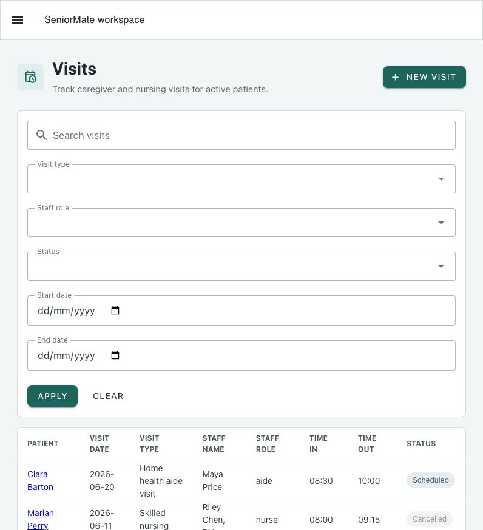

# Visits

Visits connect patient care activity to staff, dates, notes, assessments, and
care-note documentation.

## Find Visits

Search by patient, staff, visit type, or notes. Filters include patient, visit
type, staff role, status, and date range.

## Create a Visit

Authorized users provide:

- Patient
- Visit date
- Visit type
- Staff name and role
- Time in and time out
- Status
- Notes

Patient, visit date, and visit type are required. Staff role supports `aide`
and `nurse`; status supports scheduled, completed, and cancelled.

## Visit Detail

The detail page shows patient context and the actions relevant to the visit:

- Edit or delete the visit
- Create, view, or edit an aide note
- Create, view, or edit a nurse note
- Create an assessment with patient and visit preselected
- Open the printable visit summary

Actions are hidden when your role lacks permission.
